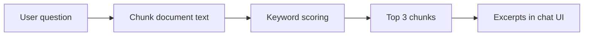
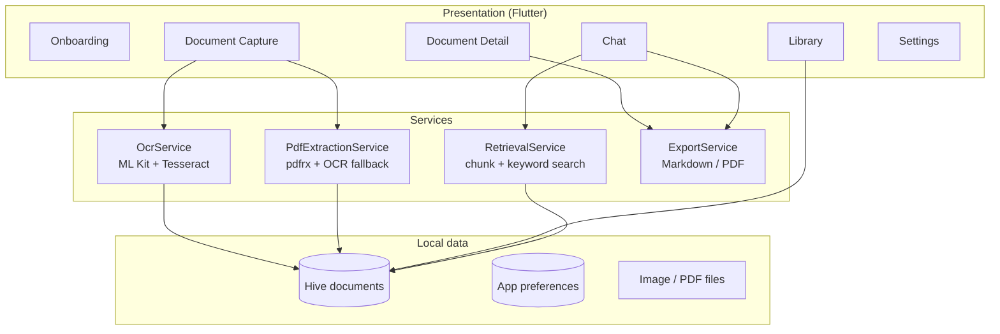

# Flutter Offline AI Document Chat

**Privacy-first ChatPDF for Flutter — scan documents, extract English & Bangla text, and ask questions without uploading files or API keys.**

[](https://flutter.dev)
[](#platform-support)
[](LICENSE)
[](#)

> Scan a receipt, lecture note, or PDF → OCR runs on your phone → save to a local library → ask questions in a chat UI. **No account. No cloud upload. No API key required.**

---

## Demo

> **TODO:** Add a 15–20 second GIF here (import → OCR → ask → answer). This is the single highest-impact item for GitHub stars.

**How to record**

1. Import a PDF or gallery image (show **English + Bangla** OCR chip if possible).
2. Save to library, open chat, ask one question, show excerpt reply.
3. Export GIF (~800px wide) with [ScreenToGif](https://www.screentogif.com/) or similar.
4. Commit to `docs/demo.gif` and add:

```markdown
<p align="center">
  
</p>
```

---

## Why this project?

Most “AI document” apps are thin wrappers around a cloud API. This repo is different: it is a **real Flutter product** with capture, OCR, local storage, PDF handling, and retrieval — built for people who do not want sensitive scans on a random server.

| | Upload PDF to ChatGPT | **This app** |
|---|------------------------|--------------|
| Files leave your device | Yes | **No** |
| Works without internet (after install) | No | **Yes** |
| Open source | No | **Yes** |
| OCR + local library + export | No | **Yes** |
| English + **Bangla (বাংলা)** OCR | Varies | **Yes** (Tesseract) |
| Natural-language “AI” summaries | Strong | **Optional** (local GGUF or cloud API) |

**Today:** default mode is **offline keyword retrieval** (fast, private excerpts). In **Settings → AI Engine** you can switch to **Local LLM** (GGUF via `llamadart`) or **Cloud API** (OpenAI-compatible endpoint with your API key).

---

## Features

### Capture & import
- Camera, gallery, and **PDF import**
- Image crop (uCrop on Android)
- **OCR language modes:** English (ML Kit), Bangla (Tesseract), English + Bangla

### PDF extraction
- **Digital PDFs:** embedded text via PDFium (`pdfrx`)
- **Scanned PDFs:** per-page render + OCR fallback
- Progress indicator (`Processing page 2 of 5…`)

### Document library
- Local storage with **Hive** (no backend)
- Search, categories (Study, Finance, Legal, Receipts, Work, Personal)
- Document detail with preview and extracted text

### Document chat (offline)
- Chat UI per document
- Text split into ~500-character chunks
- **Keyword overlap** ranking → top excerpts as answers
- Long-press to copy messages
- Export chat as Markdown

### Export & privacy
- Export document text as **Markdown** or **PDF**
- Onboarding + settings (storage stats, clear data)
- Everything stays on-device by default

---

## Screenshots

Add PNGs under `docs/screenshots/` and link them here (stars love visuals):

| Screen | File |
|--------|------|
| Onboarding | `docs/screenshots/01-onboarding.png` |
| Library | `docs/screenshots/02-library.png` |
| Capture + OCR language | `docs/screenshots/03-capture.png` |
| Document detail | `docs/screenshots/04-detail.png` |
| Chat | `docs/screenshots/05-chat.png` |

```markdown
<!-- Example once images exist -->
<p align="center">
  
  
  
</p>
```

---

## Quick start

### Prerequisites

- [Flutter SDK](https://docs.flutter.dev/get-started/install) **3.9+**
- Android Studio (Android) or Xcode (iOS)
- A physical device or emulator for OCR (recommended)

### Run

```bash
git clone https://github.com/YOUR_USERNAME/flutter-offline-ai-doc-chat.git
cd flutter-offline-ai-doc-chat/flutter_offline_ai_doc_chat
flutter pub get
flutter run
```

After adding native plugins (OCR, PDF, Tesseract), do a **full rebuild** — hot reload is not enough:

```bash
flutter clean
flutter pub get
flutter run
```

### First-time OCR note

Bangla/English Tesseract models ship in `assets/tessdata/` (`ben.traineddata`, `eng.traineddata`). They are copied to app storage on first use — the first OCR run may take a few extra seconds.

---

## Platform support

| Platform | Capture & OCR | PDF extract | Library / chat / export |
|----------|---------------|-------------|-------------------------|
| **Android** | Full (ML Kit + Tesseract) | Full | Full |
| **iOS** | Full | Full | Full |
| Windows / macOS / Linux | Limited | Limited | Library, chat, export |

Mobile is the target platform for scanning and OCR. Desktop builds can browse and chat with documents already captured on a phone.

---

## How document chat works

This is **not** ChatGPT. When you ask a question:

1. Your saved **extracted text** is split into chunks (~500 characters).
2. Chunks are scored by **keyword overlap** with your question.
3. The top matches are shown as **labeled excerpts** in the chat.



**Good for:** finding passages that contain specific words (dates, names, terms).  
**Limitation:** weak at summarization or questions that do not share words with the scan. **Phase 5** targets on-device LLM + embeddings.

---

## Architecture



Folder layout:

```
lib/
  app/              # Router, theme, dependency injection (get_it)
  core/             # Hive DB, preferences, platform utils
  features/         # Screens: onboarding, capture, library, chat, settings
  shared/           # Models, OCR, PDF extraction, retrieval, export
```

More detail: [docs/ARCHITECTURE.md](docs/ARCHITECTURE.md)

---

## Tech stack

| Area | Packages |
|------|----------|
| UI | Flutter, Material 3, go_router |
| DI | get_it |
| Storage | hive, hive_flutter, path_provider |
| OCR (English) | google_mlkit_text_recognition |
| OCR (Bangla / mixed) | tesseract_ocr |
| PDF | pdfrx, image |
| Capture | image_picker, file_picker, image_cropper |
| Export / share | pdf, share_plus |

---

## Roadmap

- [x] Phase 1 — Foundation (routing, theme, library shell)
- [x] Phase 2 — Document input (camera, gallery, PDF, crop)
- [x] Phase 3 — OCR + local DB + categories
- [x] Phase 4 — Search + chat MVP (chunk retrieval)
- [x] Phase 6 — Export, tests, docs, desktop notes
- [x] **Phase 5 — AI answers (partial)**
  - [x] On-device LLM (GGUF via `llamadart` — pick model in Settings)
  - [x] Optional cloud API (OpenAI-compatible, user-provided key)
  - [ ] Semantic search (local embeddings)
  - [ ] Multi-document chat
- [ ] README demo GIF + screenshot gallery
- [ ] Chat history persistence

---

## Testing

```bash
flutter test
flutter analyze
```

---

## Contributing

PRs welcome. Ideas for **good first issues**:

- Record and add the **demo GIF** + screenshots
- **Local LLM** integration (Android first)
- Chat message persistence in Hive
- Semantic retrieval / embeddings
- Improve Bangla OCR accuracy (preprocessing, PSM tuning)
- iOS: verify Tesseract tessdata bundling steps

1. Fork the repo  
2. Create a branch (`feature/my-change`)  
3. Run `flutter test` and `flutter analyze`  
4. Open a PR with a short screen recording if UI changes

---

## Example content

Sample text for manual testing: [docs/examples/sample_extracted_text.md](docs/examples/sample_extracted_text.md)

---

## GitHub topics

When you publish, add topics such as:

`flutter` `dart` `ocr` `pdf` `offline` `privacy` `rag` `document-scanner` `chatpdf` `tesseract` `ml-kit` `hive` `bengali` `bangla` `open-source`

---

## License

MIT — see [LICENSE](LICENSE).

---

**If this project helps you, consider starring the repo — it helps others discover privacy-first document tools built with Flutter.**
